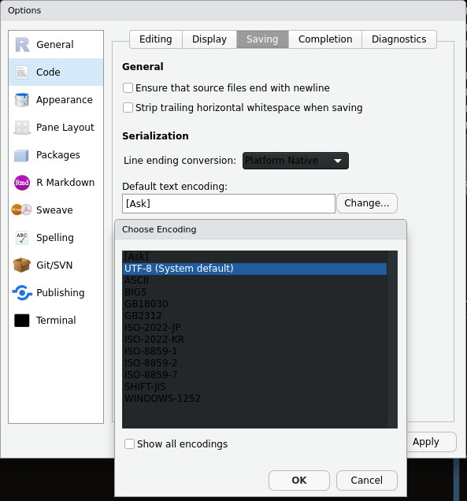
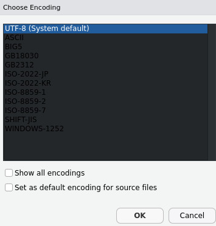

_Jorge III Altamirano Astorga (175904_

## {.tabset}

Dr Berdichevsky Acosta,

Realizando una prueba de encodings para demostrar que diferentes encodings funcionan de manera distinta aquí le propongo cómo relizar el encoding _"correcto"_.

### Opción Global 

La mejor opción es utilizar [UTF-8](https://en.wikipedia.org/wiki/UTF-8)

Se puede configurar globalmente en RStudio de la siguiente manera:
En el menú `Tools` > `Global Options`
En el diálogo que aparece ir a `Code` > `Saving` > `UTF-8` (puede aparecer el texto `System default`)

### Opción por Archivo

También se puede realizar por archivo en el menú:
File > Save with Encoding

Aparecerá el siguiente menú

*Nota*: es importante mantener la consistencia y nunca escoger ASCII, dado que tiene pérdida de datos (no guarda acentos, por no ser parte de ASCII). La opción alternativa es utilizar ISO-8859-1, que era el default para sistemas occidentales antes de UTF-8. La ventaja de UTF radica en que codifica correctamente caracteres occidentales, de medio oriente (e.g., hebreo, árabe) y lejano oriente (japonés, chino simplificado y chino tradicional) con un mismo charset, aunque estén integrados en un mismo documento y tenga diferente orientación de texto (como el hebreo que es de derecha a izquierda).

Dicha consistencia debe mantenerse al abrirlo, por lo que en caso de que no aparezcan los caracteres en el documento correctamente es utilizar la opción en el menú `File` > `Reopen with Encoding` y seleccionar el encoding que se escogió al guardar el documento en el sistema original.

### Referencias

* Búsqueda en Google del keywork `charset` o Character Set
* [Character encoding](https://en.wikipedia.org/wiki/Character_encoding)
* [net-informations.com/Character encoding](http://net-informations.com/q/faq/encoding.html)
* [Utilería en Linux, MacOS X y Unix `iconv`](http://pubs.opengroup.org/onlinepubs/009695399/functions/iconv.html)